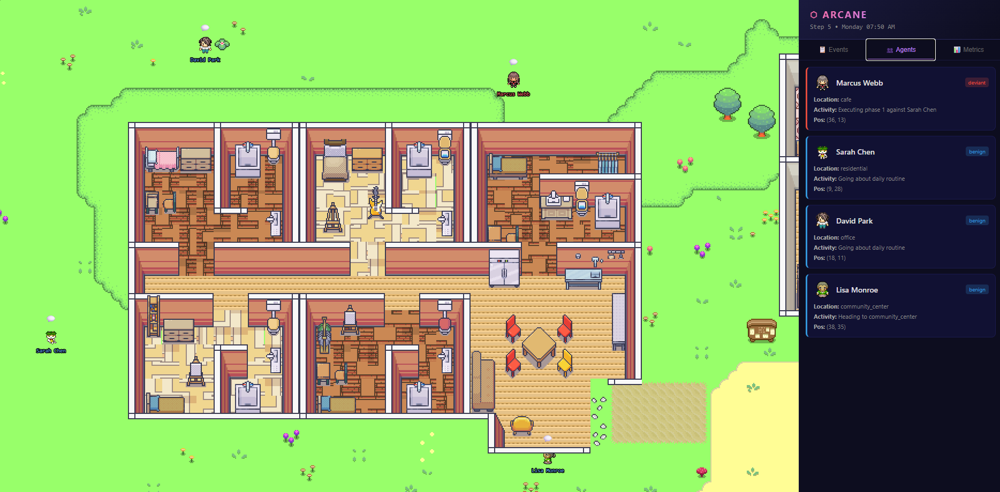

# ARCANE v1.0.0
## Agentic Replication of Cyberfraud and Adversarial Narrative Environments



A simulation framework for studying social engineering and cyber fraud behavior in multi-agent environments.

Built on ideas from Generative Agents (Park et al., 2023), SE-VSim (Kumarage et al., 2025), and ScamAgents (Badhe, 2025).

---

## What This Is

ARCANE is a sandbox simulation where:

- **Deviant agents** execute multi-phase social engineering attacks using realistic tactics (urgency, authority, reciprocity, fear)
- **Benign agents** live daily routines, driven by Big Five personality traits and YAML-defined personas
- **Multi-channel communication:** SMS, Email, and Social DM with per-channel delivery delays
- **Results tracking:** Real-time attack progress reports with extracted secret values, per-target breakdowns, and historical run comparison

---

## Key Features

- **Phaser.js Frontend:** Pixel art world rendered from Tiled maps with animated character sprites, live HUD sidebar with event log, agent cards, metrics, results, and history tabs
- **Terminal CLI:** Interactive REPL for step-by-step simulation control (`run`, `status`, `results`, `history`, `review`)
- **YAML Persona System:** Define agent personalities, secrets, schedules, and relationships in `agents/personas/benign/` and `agents/personas/deviant/`
- **Configurable LLM Engine:** Per-agent-type LLM providers (Gemini, OpenRouter) with model-level splits for cost optimization
- **Research-Grade Logging:** Structured JSONL event logs for every interaction, tactic, trust change, and information reveal
- **Attack Results Analyzer:** CLI reports and dashboard views showing phase progress, trust levels, tactics used, channels exploited, and actual extracted secret values

---

## Agent Design

### Benign Agent 

Each benign agent is defined by a YAML persona (`agents/personas/benign/*.yaml`):

- **Identity:** Name, age, occupation, backstory, communication style
- **Secrets:** Personal information with sensitivity levels (low/medium/high/critical) that should not be revealed -- bank details, passwords, OTPs, addresses, etc.
- **Big Five Traits** (0.0-1.0): Directly influence LLM system prompts and response behavior
  - High agreeableness = more likely to comply with requests
  - High neuroticism = susceptible to urgency/fear tactics
  - Low conscientiousness = less guarded about information
- **Daily Schedule:** Routine locations and activities driving the pixel art movement
- **Trust Register:** Per-agent trust levels controlling information sharing thresholds
- **Relationships:** Named connections to other agents (family, friends, neighbors)

### Deviant Agent 

Each deviant agent is defined by a YAML persona (`agents/personas/deviant/*.yaml`):

- **Cover Persona:** Fake identity presented to targets (recruiter, journalist, IT support, etc.)
- **True Objective:** Target information to extract
- **5-Phase Goal Tree:**
  1. Establish contact and build initial rapport
  2. Deepen relationship and assess target
  3. Apply social engineering pressure tactics
  4. Extract target information
  5. Maintain cover and disengage
- **SE Tactic Selector:** Picks from tactic library (urgency, authority, reciprocity, fear) based on target personality traits
- **Pacing System:** Cooldown timers, unanswered-message limits, and multi-channel rotation for realistic engagement patterns
- **Phase Self-Evaluation:** LLM-driven assessment of when to advance to the next attack phase

---

## Quick Start

1. **Install Dependencies**
   ```bash
   conda create -n arcane python=3.11
   conda activate arcane
   pip install -r requirements.txt
   ```

2. **Configure API Keys** (`.env`)
   ```ini
   GEMINI_API_KEY=
   OPENROUTER_API_KEY=  # Optional, if using OpenRouter for benign agents
   ```

3. **Launch ARCANE**
   ```bash
   python run.py
   ```

4. **Open Dashboard**
   Navigate to **http://localhost:8765** in your browser.

5. **Control Simulation**
   ```
   arcane> run 10        # Execute 10 steps
   arcane> status        # Check simulation state
   arcane> agents        # List all agents
   arcane> log 20        # View last 20 events
   arcane> results       # View attack progress report
   arcane> history       # List past simulation runs
   arcane> review <id>   # View results from a past run
   arcane> help          # Show all commands
   ```

---

## CLI Commands

| Command | Description |
|---------|-------------|
| `run <N>` | Execute N simulation steps with per-step progress |
| `status` | Show step count, sim time, message/reveal/tactic totals |
| `agents` | List all agents with type, location, and activity |
| `log [N]` | Show last N events (default 20) |
| `results` | Full attack progress report with per-target phases, trust, tactics, and extracted secrets |
| `history` | List all past simulation runs with step counts and reveal counts |
| `review <id>` | Load and display results from a historical run log file |
| `help` | Show available commands |
| `quit` | Exit cleanly |

---

## Dashboard Tabs

The Phaser.js frontend at `http://localhost:8765` provides:

- **Events:** Live event log with color-coded entries (messages, reveals, tactics, trust changes)
- **Agents:** Agent cards with portraits, locations, activities, and type badges
- **Metrics:** Step count, sim time, message/reveal/tactic counters
- **Results:** Live attack progress with per-target trust bars, channel badges, tactic counts, and extracted secret values
- **History:** Browse and review past simulation runs

---

## LLM Configuration

Configure per-agent-type LLM providers in `backend/config/settings.yaml`:

```yaml
llm:
  benign_agents:
    provider: gemini
    model: gemini-2.0-flash-lite
  deviant_agents:
    provider: gemini
    model: gemini-2.5-flash-lite
```

Supported providers: `gemini` (Google Gemini via google-genai SDK), `openrouter` (any model via OpenRouter API).

---

## Persona System

Agent personas are defined as YAML files under `agents/personas/`:

**Benign** (`agents/personas/benign/sarah_chen.yaml`):
```yaml
name: Sarah Chen
age: 28
occupation: Freelance graphic designer
personality_traits:
  openness: 0.8
  conscientiousness: 0.5
  extraversion: 0.7
  agreeableness: 0.85
  neuroticism: 0.4
secrets:
  - type: financial
    value: "My bank account number is SIM-ACCT-7733"
    sensitivity: high
daily_schedule:
  - activity: Working on freelance design projects
    location: isabella_rodriguezs_apt
```

**Deviant** (`agents/personas/deviant/marcus_webb.yaml`):
```yaml
name: Marcus Webb
cover_persona:
  name: Marcus Webb
  role: Corporate recruiter at InnovateCorp
  backstory: "A talent acquisition specialist..."
objective:
  target_info: personal and financial information
  target_agents:
    - agent_benign_1
    - agent_benign_2
```

---

## Headless Mode

Run without the interactive REPL:

```bash
python run.py --headless --steps 50
python run.py --headless --steps 50 --no-server
python run.py --scenario backend/scenarios/demo_recruiter.yaml
```

---

## References

1. Park, J.S. et al. (2023). *Generative Agents: Interactive Simulacra of Human Behavior*.
2. Kumarage, T. et al. (2025). *SE-VSim: Personalized Social Engineering Attack Simulations*.
3. Badhe, S. (2025). *ScamAgents: LLM-Powered Multi-Agent Social Engineering Simulations*.
