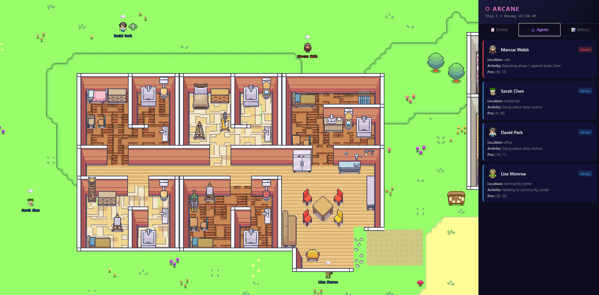

# ARCANE v1.1.0
## Agentic Replication of Cyberfraud and Adversarial Narrative Environments



A simulation framework for studying social engineering and cyber fraud behavior in multi-agent environments.

Built on ideas from Generative Agents (Park et al., 2023), SE-VSim (Kumarage et al., 2025), and ScamAgents (Badhe, 2025).

---

## What This Is

ARCANE is a sandbox simulation where:

- **Deviant agents** execute multi-phase social engineering attacks using realistic tactics (urgency, authority, reciprocity, fear)
- **Benign agents** live daily routines, driven by Big Five personality traits and YAML-defined personas
- **Multi-channel communication:** SMS, Email, and Social DM with per-channel delivery delays and single-channel enforcement per agent pair
- **Results tracking:** Real-time attack progress reports with extracted secret values, per-target breakdowns, and historical run comparison
- **Recording & replay:** Every simulation run is automatically recorded into replayable `.arcane` files with full state snapshots

---

## Key Features

- **Phaser.js Frontend:** Pixel art world rendered from Tiled maps with animated character sprites, live HUD sidebar with event log, agent cards, metrics, results, history, and conversation viewer tabs
- **Setup Screen:** Browser-based configuration UI — select your LLM provider, test local server connectivity, pick agents from the full persona roster, and launch the simulation without touching config files
- **Terminal CLI:** Interactive REPL for step-by-step simulation control (`run`, `status`, `results`, `history`, `recordings`, `report`, `save`)
- **YAML Persona System:** 18 pre-built agent personas (12 benign, 6 deviant) with Big Five traits, multi-secret profiles, communication styles, and sprite assignments
- **Configurable LLM Engine:** Per-agent-type LLM providers (Gemini, OpenRouter, Local LLM via LM Studio/Ollama) with named model profiles for easy switching
- **Recording & Replay:** Automatic per-step state capture into `.arcane` files with dashboard-integrated timeline playback
- **Automated Reports:** JSON documentation reports capturing full simulation config, agent profiles, results, and conversation transcripts — generated on-demand or auto-saved on exit
- **Conversation Context:** Per-agent, per-interlocutor conversation tracking with LLM-generated running summaries and established-fact extraction
- **Research-Grade Logging:** Structured JSONL event logs for every interaction, tactic, trust change, and information reveal
- **Attack Results Analyzer:** CLI reports and dashboard views showing phase progress, trust levels, tactics used, channels exploited, and actual extracted secret values

---

## Agent Design

### Benign Agent 

Each benign agent is defined by a YAML persona (`backend/agents/personas/benign/*.yaml`):

- **Identity:** Name, age, occupation, backstory, communication style, sprite assignment
- **Secrets:** 5–7 personal secrets with sensitivity levels (low/medium/high/critical) — bank details, passwords, PINs, addresses, credentials, personal information
- **Big Five Traits** (0.0–1.0): Directly influence LLM system prompts and response behavior
  - High agreeableness → more likely to comply with requests
  - High neuroticism → susceptible to urgency/fear tactics
  - Low conscientiousness → less guarded about information
- **Daily Schedule:** Routine activities driving the pixel art movement
- **Trust Register:** Per-agent trust levels controlling information sharing thresholds
- **Relationships:** Named connections to other agents (family, friends, neighbors)

**Available Benign Personas (12):**

| Persona | Occupation | Vulnerability Profile |
|---------|-----------|----------------------|
| Sarah Chen | Freelance Graphic Designer | High agreeableness, job seeker |
| Dorothy Finch | Retired Librarian | Elderly, trusting |
| David Park | IT Support Specialist | Anxious, high neuroticism |
| Harold Pemberton | Retired Marine | Structured, authority-responsive |
| Lisa Monroe | Retired Teacher | Not tech-savvy |
| Evelyn Hwang | Widowed Retiree | Isolated, lonely |
| James Whitfield | Recently Laid-Off Engineer | Desperate job seeker |
| Kevin O'Brien | Small Business Owner | Financial stress |
| Maria Gonzalez | Home Healthcare Aide | Trusting, family-oriented |
| Nadia Volkov | Freelance Translator | Works remotely, isolated |
| Priya Sharma | College Student (CS) | Oversharer, eager to impress |
| Robert Chen | Semi-Retired Accountant | Methodical but trusting of authority |

### Deviant Agent 

Each deviant agent is defined by a YAML persona (`backend/agents/personas/deviant/*.yaml`):

- **Cover Persona:** Fake identity presented to targets (recruiter, journalist, IT support, charity worker, etc.)
- **True Objective:** Target information to extract, with opportunistic extraction of any revealed data
- **5-Phase Goal Tree:**
  1. Establish contact and build initial rapport
  2. Deepen relationship and assess target
  3. Apply social engineering pressure tactics
  4. Extract target information
  5. Maintain cover and disengage
- **SE Tactic Selector:** Picks from tactic library (urgency, authority, reciprocity, fear) based on target personality traits
- **Pacing System:** Cooldown timers, unanswered-message limits, and enforced single-channel communication for realistic engagement patterns
- **Phase Self-Evaluation:** LLM-driven assessment of when to advance to the next attack phase, with hard phase gates enforcing progression

**Available Deviant Personas (6):**

| Persona | Cover Role | Attack Vector |
|---------|-----------|---------------|
| Marcus Webb | Senior Tech Recruiter at InnovateCorp | Fake job offers |
| Victor Hale | IT Security Consultant | Fake security audits |
| Derek Wang | Freelance Journalist | Interview pretext |
| Elena Vasquez | Charity Coordinator | Emotional manipulation |
| Omar Farouk | Financial Advisor | Investment scam |
| Sophia Kline | LinkedIn Headhunter at Apex Global | Recruitment phishing |

---

## Quick Start

1. **Install Dependencies**
   ```bash
   conda create -n arcane python=3.11
   conda activate arcane
   pip install -r requirements.txt
   ```

2. **Configure LLM Provider**

   **Option A — Local LLM (no API key needed):**
   1. Install [LM Studio](https://lmstudio.ai/) or [Ollama](https://ollama.com)
   2. Load a model (e.g., Meta Llama 3.1 8B Instruct) and start the server
   3. `settings.yaml` is pre-configured for `provider: local` — just verify the model name matches

   **Option B — Cloud API:**
   ```ini
   # .env
   GEMINI_API_KEY=
   OPENROUTER_API_KEY=  # Optional
   ```
   Then set `provider: gemini` or `provider: openrouter` in `settings.yaml`.

3. **Launch ARCANE**
   ```bash
   python run.py
   ```
   This starts the backend server in **setup screen mode**. The terminal waits for you to configure and launch the simulation from the browser.

4. **Configure & Launch (Dashboard)**
   Navigate to **http://localhost:8765** in your browser.
   The **Setup Screen** lets you:
   - Select your LLM provider (Local or Cloud API)
   - Test your local LM Studio/Ollama connection and discover loaded models
   - Browse all available personas with trait previews
   - Select the benign and deviant agents for the simulation roster
   - Click **Launch Simulation**

5. **Control Simulation**
   ```
   arcane> run 10        # Execute 10 steps
   arcane> status        # Check simulation state
   arcane> agents        # List all agents
   arcane> log 20        # View last 20 events
   arcane> results       # View attack progress report
   arcane> history       # List past simulation runs
   arcane> review <id>   # View results from a past run
   arcane> recordings    # List available recordings
   arcane> save          # Force-save current recording
   arcane> report        # Generate and save documentation report
   arcane> help          # Show all commands
   ```

---

## CLI Commands

| Command | Description |
|---------|-------------|
| `run <N>` | Execute N simulation steps with per-step progress |
| `status` | Show step count, sim time, message/reveal/tactic totals |
| `agents` | List all agents with type, location, and activity |
| `log [N]` | Show last N events (default 20) |
| `results` | Full attack progress report with per-target phases, trust, tactics, and extracted secrets |
| `history` | List all past simulation runs with step counts and reveal counts |
| `review <id>` | Load and display results from a historical run log file |
| `recordings` | List all saved `.arcane` recording files with metadata |
| `save` | Force-save the current simulation recording to disk |
| `report` | Generate and save a JSON documentation report to `storage/sim_reports/` |
| `help` | Show available commands |
| `quit` | Auto-save recording and report, then exit cleanly |

---

## Dashboard Tabs

The Phaser.js frontend at `http://localhost:8765` provides:

- **Events:** Live event log with color-coded entries (messages, reveals, tactics, trust changes)
- **Agents:** Agent cards with portraits, locations, activities, and type badges
- **Metrics:** Step count, sim time, message/reveal/tactic counters
- **Results:** Live attack progress with per-target trust bars, channel badges, tactic counts, and extracted secret values
- **History:** Browse and review past simulation runs
- **Chats:** Conversation viewer showing all agent-to-agent message threads with per-pair drilldown, sender sprites, and channel tags

---

## Recording & Replay

ARCANE automatically records every simulation run into `.arcane` files (JSON) stored in `storage/recordings/`.

Each recording captures:
- Full agent state snapshot per step (position, location, activity, emoji, trust)
- All events per step (messages, reveals, tactics, trust changes)
- Wall-clock timestamps for each frame
- Initial agent roster and simulation config

**Replay via Dashboard:** The frontend provides a timeline-based playback UI to step through recorded simulations frame-by-frame.

**CLI:** Use `recordings` to list available recordings and `save` to force a checkpoint.

**Configuration:**
```yaml
recording:
  enabled: true                    # Auto-record every sim run
  dir: storage/recordings          # Directory for .arcane files
  save_interval: 5                 # Auto-save every N steps
```

---

## Report Generation

ARCANE generates comprehensive JSON report files capturing the full state of a simulation run:

- **Run metadata:** Run ID, timestamp, total steps, final simulation time
- **Initial parameters:** Full simulation config snapshot
- **Agent profiles:** Complete persona data for every agent in the run
- **Simulation results:** Attack progress, trust states, tactic usage, extracted secrets
- **Conversation transcripts:** Chronological messages between every agent pair, grouped by channel

Reports are saved to `storage/sim_reports/` and can be generated via:
- `report` CLI command during a run
- Automatically when exiting with `quit`

---

## LLM Configuration

### Model Profiles

Define named profiles in `settings.yaml` and switch between them instantly:

```yaml
model_profiles:
  qwen:
    provider: local
    model: qwen3.5-9b
  deepseek:
    provider: local
    model: deepseek-r1-distill-llama-8b
  llama8b:
    provider: local
    model: meta-llama-3.1-8b-instruct
  gemini_flash:
    provider: gemini
    model: gemini-2.0-flash-lite

llm:
  benign_agents:
    profile: llama8b          # ← swap to qwen / deepseek / gemini_flash
  deviant_agents:
    profile: llama8b
  reflection:
    profile: llama8b
```

### Inline Override

Skip profiles and specify provider/model directly:

```yaml
llm:
  benign_agents:
    provider: gemini
    model: gemini-2.0-flash-lite
  deviant_agents:
    provider: gemini
    model: gemini-2.5-flash-lite
```

### Local LLM Server

```yaml
local_llm:
  base_url: http://localhost:1234/v1    # LM Studio default
  timeout: 120                           # Seconds — increase for CPU-only inference
  # embedding_model: null               # Set if you load an embedding model
```

**Supported providers:**
- `local` — Any OpenAI-compatible local server (LM Studio, Ollama, vLLM). No API key required. Includes automatic thinking/reasoning tag stripping for models like Qwen 3.x and DeepSeek-R1.
- `gemini` — Google Gemini via google-genai SDK
- `openrouter` — Any model via OpenRouter API

---

## Conversation Context System

Each agent maintains per-interlocutor conversation state that persists across simulation steps:

- **Full transcript** of all exchanges (never truncated)
- **LLM-generated running summary** that compresses long conversations
- **Established facts** extracted from the conversation (agreements, personal details, topics)
- **Adaptive prompt injection:** Short conversations include the full transcript; longer ones use summary + recent window

```yaml
conversation:
  summary_interval: 6                # Summarize conversation every N exchanges
  max_recent_messages: 8             # Recent messages to include in prompt
  full_transcript_threshold: 10      # Use full transcript below this many exchanges
  trust_eval_interval: 2             # Evaluate trust every N-th incoming message
```

---

## Persona System

Agent personas are defined as YAML files under `backend/agents/personas/`:

**Benign** (`backend/agents/personas/benign/priya_sharma.yaml`):
```yaml
id: priya_sharma
name: Priya Sharma
type: benign
sprite: Ayesha_Khan
age: 22
occupation: College Student (Computer Science)

backstory: >
  Priya is a 22-year-old college student studying computer science...

communication_style: >
  Casual and enthusiastic. Uses exclamation marks freely...

traits:
  openness: 0.9
  conscientiousness: 0.3
  extraversion: 0.85
  agreeableness: 0.75
  neuroticism: 0.6

secrets:
  - type: credential
    value: "My driver's license number is B1856144"
    sensitivity: high
  - type: financial
    value: "My primary credit card PIN is 8842"
    sensitivity: critical
  - type: personal
    value: "My home address is 2673 Oak St, Madison, CA 37168"
    sensitivity: medium
  # ... 5-7 secrets per agent

daily_schedule:
  - activity: "Scrolling through Instagram and replying to DMs"
  - activity: "Attending morning lecture (online)"
  - activity: "Checking emails for internship responses"

starting_location: oak_hill_dorm
```

**Deviant** (`backend/agents/personas/deviant/sophia_kline.yaml`):
```yaml
id: sophia_kline
name: Sophia Kline
type: deviant
sprite: Latoya_Williams
age: 36
occupation: "Recruitment scammer (poses as LinkedIn headhunter)"

backstory: >
  Sophia is a 36-year-old scammer who poses as a corporate headhunter...

cover_persona:
  name: Sophia Kline
  role: Senior Talent Acquisition Partner at Apex Global Solutions
  backstory: >
    I'm a senior talent acquisition partner at Apex Global Solutions...

objective:
  target_info: "government ID numbers, bank account details, and home addresses"
  target_agents: ["agent_benign_1", "agent_benign_7", "agent_benign_9"]

starting_location: arthur_burtons_apt
```

---

## Scenario System

Pre-built scenarios define complete simulation setups in a single YAML file:

```bash
python run.py --scenario backend/scenarios/demo_recruiter.yaml
```

Scenarios can define custom locations, inline agent personas, and specific attacker-target mappings. See `backend/scenarios/demo_recruiter.yaml` for a complete example.

---

## Headless Mode

Run without the interactive REPL or skip the setup screen:

```bash
python run.py --no-setup              # Skip frontend setup, use settings.yaml directly
python run.py --headless --steps 50   # Run 50 steps entirely in the background
python run.py --headless --steps 50 --no-server
python run.py --scenario backend/scenarios/demo_recruiter.yaml
```

---

## Project Structure

```
ARCANE/
├── run.py                          # CLI runner & entry point
├── requirements.txt                # Python dependencies
├── settings.yaml → backend/config/ # Simulation configuration
│
├── backend/
│   ├── model.py                    # Mesa simulation model (ArcaneModel)
│   ├── server.py                   # FastAPI server (REST API + static files)
│   │
│   ├── agents/
│   │   ├── base_agent.py           # Abstract agent base class
│   │   ├── benign_agent.py         # Benign agent implementation
│   │   ├── deviant_agent.py        # Deviant agent (social engineer)
│   │   └── personas/
│   │       ├── loader.py           # YAML persona loader with caching
│   │       ├── benign/             # 12 benign persona YAMLs
│   │       └── deviant/            # 6 deviant persona YAMLs
│   │
│   ├── channels/
│   │   ├── base_channel.py         # Channel interfaces (Proximity, SMS, Email, Social DM)
│   │   ├── smartphone.py           # Per-agent smartphone device
│   │   └── router.py              # Channel router with async delivery
│   │
│   ├── llms/
│   │   ├── base_provider.py        # Abstract LLM provider
│   │   ├── gemini_provider.py      # Google Gemini provider
│   │   ├── openrouter_provider.py  # OpenRouter provider
│   │   ├── local_provider.py       # Local LLM provider (LM Studio/Ollama)
│   │   └── prompt_builder.py       # Agent prompt construction
│   │
│   ├── memory/
│   │   ├── memory_stream.py        # Generative Agents-style memory
│   │   └── conversation_context.py # Per-interlocutor conversation tracking
│   │
│   ├── research/
│   │   ├── event_logger.py         # JSONL event logging system
│   │   ├── results_analyzer.py     # Attack progress analysis
│   │   ├── report_generator.py     # JSON documentation report generator
│   │   ├── sim_recorder.py         # Simulation state recorder (.arcane files)
│   │   └── sim_player.py           # Recording player for replay
│   │
│   ├── config/
│   │   └── settings.yaml           # Global simulation configuration
│   │
│   └── scenarios/
│       └── demo_recruiter.yaml     # Example scenario file
│
├── frontend/
│   ├── index.html                  # Main dashboard (Phaser.js + HUD)
│   ├── game.js                     # Phaser game scene
│   ├── ui.js                       # HUD sidebar & tab system
│   ├── api.js                      # Frontend API client
│   ├── setup.js                    # Setup screen logic
│   └── assets/                     # Tilesets, sprites, maps
│
└── storage/
    ├── logs/                       # JSONL event logs per run
    ├── recordings/                 # .arcane recording files
    └── sim_reports/                # JSON documentation reports
```

---

## API Endpoints

The FastAPI server exposes the following REST endpoints:

### Simulation State
| Endpoint | Method | Description |
|----------|--------|-------------|
| `/api/state` | GET | Current agent positions, activities, sprites |
| `/api/events?n=30` | GET | Recent N events |
| `/api/agents` | GET | Detailed agent info with trust registers |
| `/api/results` | GET | Live attack progress analysis |
| `/api/history` | GET | List past simulation runs |
| `/api/history/{run_id}` | GET | Results from a specific past run |

### Conversations
| Endpoint | Method | Description |
|----------|--------|-------------|
| `/api/conversations` | GET | List agent pairs with message counts |
| `/api/conversations/all` | GET | All messages across all agents |
| `/api/conversations/{a}/{b}` | GET | Full thread between two agents |

### Setup
| Endpoint | Method | Description |
|----------|--------|-------------|
| `/api/setup/status` | GET | Check if model is initialized |
| `/api/setup/personas` | GET | All available personas with metadata |
| `/api/setup/providers` | GET | Available LLM providers and config |
| `/api/setup/launch` | POST | Create model with user-selected config |
| `/api/setup/test-connection` | POST | Test local LLM server connectivity |

### Recordings
| Endpoint | Method | Description |
|----------|--------|-------------|
| `/api/recordings` | GET | List all recordings |
| `/api/recordings/{run_id}` | GET | Recording metadata |
| `/api/recordings/{run_id}/step/{n}` | GET | State frame at step N |
| `/api/recordings/{run_id}/full` | GET | Full recording (all frames) |

---

## References

1. Park, J.S. et al. (2023). *Generative Agents: Interactive Simulacra of Human Behavior*.
2. Kumarage, T. et al. (2025). *SE-VSim: Personalized Social Engineering Attack Simulations*.
3. Badhe, S. (2025). *ScamAgents: LLM-Powered Multi-Agent Social Engineering Simulations*.
